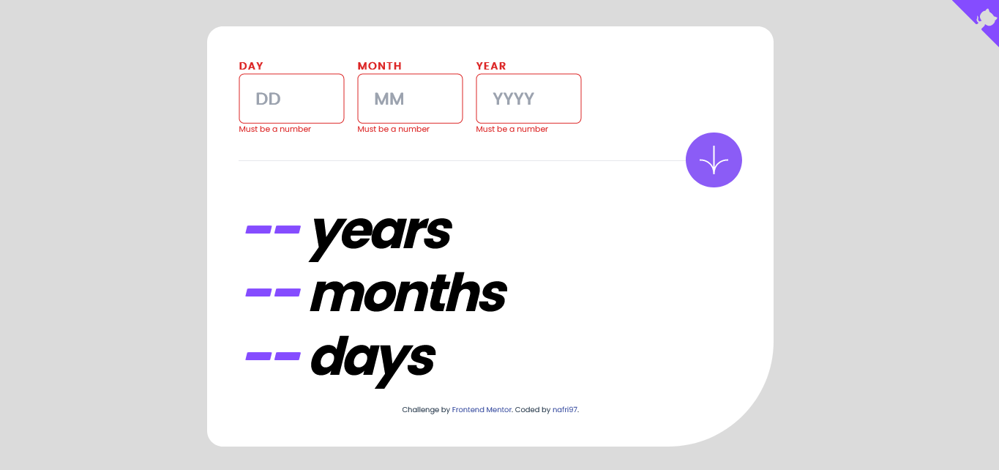
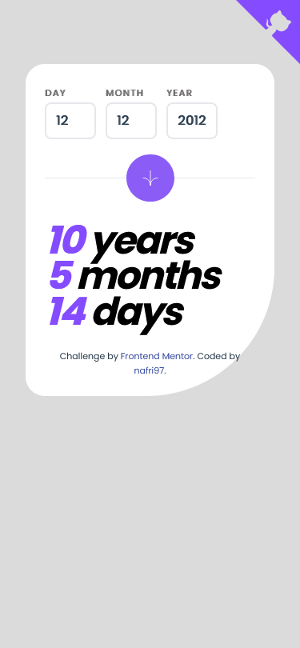

# Frontend Mentor - Age calculator app solution

This is a solution to the [Age calculator app challenge on Frontend Mentor](https://www.frontendmentor.io/challenges/age-calculator-app-dF9DFFpj-Q). Frontend Mentor challenges help you improve your coding skills by building realistic projects. 

## Table of contents

- [Overview](#overview)
  - [The challenge](#the-challenge)
  - [Screenshot](#screenshot)
  - [Links](#links)
- [My process](#my-process)
  - [Built with](#built-with)
  - [What I learned](#what-i-learned)
  - [Continued development](#continued-development)
  - [Useful resources](#useful-resources)
- [Author](#author)
- [Acknowledgments](#acknowledgments)

**Note: Delete this note and update the table of contents based on what sections you keep.**

## Overview

### The challenge

Users should be able to:

- View an age in years, months, and days after submitting a valid date through the form
- Receive validation errors if:
  - Any field is empty when the form is submitted
  - The day number is not between 1-31
  - The month number is not between 1-12
  - The year is in the future
  - The date is invalid e.g. 31/04/1991 (there are 30 days in April)
- View the optimal layout for the interface depending on their device's screen size
- See hover and focus states for all interactive elements on the page
- **Bonus**: See the age numbers animate to their final number when the form is submitted

### Screenshot





### Links

- Solution URL: [Github Repository](https://github.com/nafri97/age-calculator)
- Live Site URL: [Vercel App](http://age-calculator-hipo5l075-nafri97.vercel.app)

## My process

### Built with

- Semantic HTML5 markup
- CSS custom properties
- Flexbox
- Javascript
- [Vue.js](https://vuejs.org/) - JS library
- [vite.js](https://vitejs.dev/) - Help me to build my vue app
- [Tailwind CSS](https://https://tailwindcss.com/) - For styles

**Note: These are just examples. Delete this note and replace the list above with your own choices**

### What I learned

Use this section to recap over some of your major learnings while working through this project. Writing these out and providing code samples of areas you want to highlight is a great way to reinforce your own knowledge.

To see how you can add code snippets, see below:

```css
@tailwind base;
@tailwind components;
@tailwind utilities;

@layer components {
  .label {
    @apply uppercase font-bold text-base tracking-widest;
  }

  .input {
    @apply border-solid border-2 rounded-lg py-2 md:py-4 pl-3 md:pl-6 font-black w-16 md:w-40 focus:outline-none
  }
}
```
```js
  data(){
    return{
      currentDate: new Date().toLocaleDateString(),
      currentDay : new Date().getDate(),
      currentMonth : new Date().getMonth() + 1, //getMonth strart in 0
      currentYear : new Date().getFullYear(),
    }
  },
  components: {
    copyright,
  },
  computed: {
    day() {
      //
    }
```

### Continued development

I will learn more about Javascript and its Library especially vue.js, and in the future I will learn Typescript.


### Useful resources

- [w3school](https://www.w3school.com/) -the most complete Documentation.
- [ChatGPT](https://www.chat.openai.com/) - My Reliable assistant :D.


## Author

-Linkedin - [Irfan Rizki Saputra] (http://linkedin.com//in/nafri97)
- Frontend Mentor - [@nafri97](https://www.frontendmentor.io/profile/nafri97)
- Twitter - [@irfanrizkis](https://www.twitter.com/irfanrizkis)


## Acknowledgments

This is where you can give a hat tip to anyone who helped you out on this project. Perhaps you worked in a team or got some inspiration from someone else's solution. This is the perfect place to give them some credit.

========================================================================

# age-calculator

This template should help get you started developing with Vue 3 in Vite.

## Recommended IDE Setup

[VSCode](https://code.visualstudio.com/) + [Volar](https://marketplace.visualstudio.com/items?itemName=Vue.volar) (and disable Vetur) + [TypeScript Vue Plugin (Volar)](https://marketplace.visualstudio.com/items?itemName=Vue.vscode-typescript-vue-plugin).

## Customize configuration

See [Vite Configuration Reference](https://vitejs.dev/config/).

## Project Setup

```sh
npm install
```

### Compile and Hot-Reload for Development

```sh
npm run dev
```

### Compile and Minify for Production

```sh
npm run build
```
